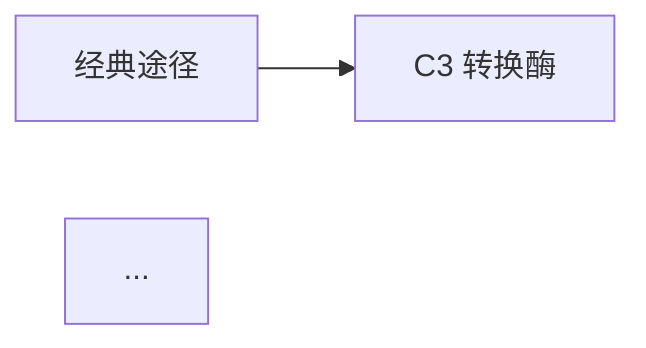

# 电子书阅读（ebook-reader）— 自述文件

> 按章节阅读 PDF 电子书 / 长文档，输出结构化总结（含每章思维导图、公式/代码/推导逐字保留、缩写词表、关系图），并支持基于原文的问答。
> 本文件是 skill 的完整流程说明，随 skill 一起迁移。

---

## 一、这个 skill 能做什么

| 能力 | 说明 |
|------|------|
| 按章节读取 | 优先用 PDF 内嵌书签（TOC）切章，失败则回退标题启发式正则（支持"第一章"/"Chapter 1"） |
| 章节总结 | 每章：核心立意 + 3–8 条关键要点 + 公式/代码/推导逐字保留 + 开放问题 |
| 每章思维导图 | Mermaid `mindmap`，≤2 层、≤20 节点，紧跟章节标题 |
| 缩写词表 | 总结开头列出所有出现过的缩写及全称（以书中原文为准，禁止编造） |
| 关系图 | 有明确先后顺序/流程/时序/因果的内容，绘制小 Mermaid 图（flowchart / sequenceDiagram / timeline / stateDiagram） |
| AI 识图 | **兜底手段**：仅当文字层无法提供图内容（乱码/缺失/用户专问视觉布局）时，针对性渲染该页 PNG 用多模态识读；不因 PDF 有图就整张/整本识图 |
| 扫描版 PDF | 无文字层的书也能读：页面转 PNG → AI 视觉逐页识读，无需 OCR 工具 |
| 基于原文问答 | 关键词定位章节+页码，严格按书中内容回答并附引用，禁止编造 |

---

## 二、两种工作模式

1. **总结模式（Mode A）** — 把书变成结构化的逐章 Markdown 总结文件。
2. **问答模式（Mode B）** — 就书的内容提问，答案严格基于原文、附章节+页码引用。

两种模式共用同一个提取步骤（Step 1–2），提取一次、JSON 复用，后续提问不必重新提取。

---

## 三、完整工作流程

### 阶段 0 — 环境准备（可移植路径）

所有命令用 `~` 表示用户主目录，在任何设备上都可用：

- **skill 目录**：`~/.workbuddy/skills/ebook-reader/`（用户级安装）；若是项目级安装则为 `<项目>/.workbuddy/skills/ebook-reader/`
- **Python 解释器**：
  - Windows：`~/.workbuddy/binaries/python/versions/<版本>/python.exe`（取最新的 3.x）
  - macOS/Linux：`python3`（或受管解释器）
- **依赖**（只装进受管环境，绝不全局安装）：
  - 文本提取：`pip install pypdf`
  - 页面渲染：`pip install pymupdf`（PyMuPDF）

### Step 1 — 提取文本与章节边界

```bash
~/.workbuddy/binaries/python/versions/<版本>/python.exe \
  ~/.workbuddy/skills/ebook-reader/scripts/extract_pdf.py \
  "<PDF路径>" --out "<工作区>/_pdf_extract.json"
```

产物 `_pdf_extract.json` 包含：`num_pages`、`has_embedded_toc`、`toc_usable`、`is_scanned`、`chapters[]`（每章有 `index/title/start_page/end_page/text`）、`pages[]`（逐页全文）。**整个会话保留此文件**，总结和问答都从它读。

### Step 2 — 校验章节切分（总结前必查）

- **`is_scanned`** = true → 无文字层，走 Step 2.6（AI 视觉识读，默认推荐）；也可让用户先本地 OCR 再重新提取
- **`toc_usable`** = false → 书签只有页码，脚本已回退标题启发式，需人工确认章节标题有意义
- 内嵌书签可用 → 按书自身书签切分，通常可靠
- 启发式切分 → 快速检查每章 `title/start_page`，边界错误就手动重划（读取相关 `pages` 文本），**不要默默接受坏切分**
- 整本书无可用结构 → 按固定页段总结（如"第 1 部分 (p.1–15)"）

### Step 2.5 — AI 识图救援（兜底手段，非默认）

**核心原则：识图是兜底，不是默认路径。** 文字层是主要信息来源——图的内容大多已由图注、正文描述传达，不要因为 PDF 里有图就整页/整本渲染识读。**只有文字层确实无法提供所需图内容时**（图注/正文乱码、图注点名内容但文字不可读、用户专门问图的视觉布局），才针对性渲染**该图所在页**。

**触发条件（全部满足才用）**：detect_math_code 返回的 math 多为乱码（`$...$` 标签、无法映射的字形）**且图注/正文不足以传达图内容**；总结/提问依赖某图的**视觉布局**且文字层未描述；图注能看出内容但正文文字层不可读；页面文字极少但有图。**不触发**：图内容已被图注/正文完全描述、装饰性图片、文字层提取正常的页面。

流程：
1. 用 `search_pdf.py "<json>" "图" --top 50` 定位候选图页（0-based 页码）
2. 渲染目标页为 PNG：`export_images.py "<PDF>" --pages 59,60,67 --out "<工作区>/_pdf_images" --dpi 150`（装不了 PyMuPDF 时用 `--embedded` 回退提取嵌入图）——**只渲染需要的页，不整本渲染**
3. 用 Read 工具（多模态）忠实识读：标签、箭头、顺序、图例、坐标轴值都要转述
4. 引用格式：`（据图2.15，PDF p.59）`
5. 图实在看不清 → 诚实说明，不编造；可提高 `--dpi`（如 250）重试

### Step 2.6 — 扫描版 / 纯图片 PDF（无文字层）

1. **先与用户确认范围**：小书（<~30 页）整本读；大书问清要读哪些章节/页段（AI 视觉按页计费，成本线性增长）
2. 渲染页面：`export_images.py "<PDF>" --pages 0,1,2,10-20 --out "<工作区>/_scanned_pages" --dpi 200`（密文/图示/非拉丁文字建议 200 以上；整本可用 `--pages "0-N"`）
3. Read 逐页识读，建立逐页记录：页码、页面内容、值得引用的原文
4. 合成为章节总结（沿用 Mode A 模板）或直接回答
5. **必须标注来源**：`（p.10，AI 视觉识读）`
6. 渲染的 PNG 保留在 `<工作区>/_scanned_pages/` 供用户翻看，总结确认后可删除

> 此模式把 AI 当免 OCR 阅读器。高吞吐归档场景仍推荐专用 OCR（Tesseract/PaddleOCR 等），但快速读扫描版无需搭建 OCR 工具链。

### Mode A — 总结模式（写出章节总结）

**1. 先定位公式/代码/推导**：运行检测器

```bash
~/.workbuddy/binaries/python/versions/<版本>/python.exe \
  ~/.workbuddy/skills/ebook-reader/scripts/detect_math_code.py \
  "<工作区>/_pdf_extract.json" --context 400
```

必须遵守的规则：
- 数学公式：**逐字保留**（LaTeX 或 Unicode 原样，保留 `$...$`/`$$...$$`），禁止只用文字概括公式
- 代码示例：原样放进围栏代码块（```python / ```cpp 等）
- 推导/证明：**逐步保留每一中间行**，禁止折叠成"推导过程略"
- 定义/数据表：逐字或近逐字保留
- 提取太乱无法复原 → 保留最接近的可读版本并标注"（原文提取可能不完整）"

**2. 逐章提炼**（每章）：
- 核心立意（1–2 句）
- 关键要点（3–8 条列表）
- 公式与代码（来自步骤 1）
- 开放问题或争议（如有）
- 缩写词记录：全称**只取书中原文**（首次展开处或术语表），原文没有就标"（原文未给出全称）"，禁止编造；跨章去重合并
- 关系图检查：发现明确先后/流程/因果内容 → 画小 Mermaid 图（flowchart LR/TD 默认；sequenceDiagram 用于时序交互；timeline 用于历史事件；stateDiagram-v2 用于状态转换）

**3. 长章拆分**：单章 text 超过 ~1.2 万字符 → 分子节分别总结再合并

**4. 每章思维导图**：Mermaid `mindmap`，根=章标题，分支=主题，叶=要点；≤2 层、≤20 节点，紧跟章标题

**5. 关系图**：把步骤 2 识别出的有序内容画成图，放在所属章节（关键要点之后 / 公式代码段内 / 或"**关系图：**"单独一行）。硬约束：一图一主题；≤10 节点；短标签；箭头只在必要时加文字；**只画书中明确内容，不发明步骤**；推断过渡用虚线 `-.->` 并标注"（书中未明说，推断）"；太复杂拆成 2–3 张子图

**6. 写出 .md 文件（强制）**：
- 交付物**必须**是 Markdown 文件：`<工作区>/<书名>_章节总结.md`
- 禁止只输出聊天文本、禁止其他格式（docx/pdf/html/txt 等），除非用户明确要求
- 用 Write 工具创建，结构见下方模板
- 写完后通过文件呈现机制展示给用户；聊天里可附简短摘要，但文件才是交付物

**7. 写后核对（强制，展示前必做）**：写完文件后、展示给用户前，**回到源头逐项核对**，不凭记忆、不凭"实验逻辑应该如此"：
- **硬数据**：剂量、时间点（Day -X / Day X）、组别标签（G1/G2、Q1/Q2）、细胞数、百分比、p 值、生存天数——与原文**逐字符一致**；原文若看起来"不合理"，照抄原文，**绝不自行"合理化"**
- **图解读**：每个 Figure 子面板（A/B/C/...）的描述（轴标签、图例、趋势、关键数字）对照实际图核实
- **逐字内容**：公式/代码/推导/定义/引语与源**逐字一致**；乱码处保留最接近版本并标注，不静默"修正"
- **缩写表**：每个缩写/全称对都能溯源到书；无编造、无猜测
- **关系图**：每个步骤/箭头反映书中实际内容；推断处标注"（书中未明说，推断）"
- **引用**：章节名和页码指向真正支撑该论断的段落
- 任一项不符 → 立即改文件并复核，之后才展示。**用户问"你确定吗"时应重新读源头，而不是为草稿辩护。**

**位置铁律（缩写词表）**：缩写词表必须是文件第一个章节——紧跟 `# 标题` 和 `> 来源` 行之后、"全书概览"之前。它不是页脚/附录，**禁止放文件末尾**。书中若有天然术语表想额外引用，可放文末复述，但缩写词表本身永远在顶部。

**输出文件模板：**

```markdown
# 《<书名>》章节关键总结

> 来源：<文件名>  · 共 <N> 页  · 自动切分 <M> 章  · 生成日期 <YYYY-MM-DD>

## 缩写词表（Abbreviations）
> 本总结涉及的所有缩写词及其全称（以书中原文为准；原文未给出全称的标注"原文未给出"）。
> 出处页码为 PDF 页（0-based + 1）。

| 缩写 | 全称（原文） | 出处 |
|------|--------------|------|
| DNA  | Deoxyribonucleic acid（脱氧核糖核酸） | 第 1 章 p.5 |
| ...  | ... | ... |

## 全书概览
<3–6 句话概括本书主旨、目标读者、核心价值与整体脉络>

## 全书思维导图


## 目录
1. [<第1章标题>](#<锚点1>) — p.<start>–<end>
...

## 第 1 章 <标题>（p.<start>–<end>）


**核心立意：** <一句话>

**关键要点：**
- ...

**关系图（有明确先后顺序/流程/时序/因果的内容，无则省略本节）：**


**公式 / 代码 / 推导：**
> 数学公式（书中原文，p. X）：
> `$$ ... $$` 或纯文本公式

> 代码示例（书中原文，p. X）：
> ```python
> ...原样代码...
> ```

> 推导过程（书中原文，p. X–Y）：
> 第 1 步 ...
> 第 2 步 ...

**开放问题或争议：** <如有>
```

目录锚点用 GitHub 风格（`#` + 小写标题、空格转连字符），保证目录链接可跳转。

### Mode B — 问答模式（严格基于原文）

**先加载忠实度细则**：回答任何问题前，先 `Read references/qa_grounding.md`（核心原则 + 引用格式 + 反编造检查清单，每次回答都要过一遍）。

1. **定位相关段落**：`search_pdf.py "<json>" "<关键词1>" "<关键词2>" --top 8`（中英文均可，同义词分开传；返回 `chapter_title/page/match_count/snippet`）
2. **读全文上下文**：打开命中的 `chapters[i].text` 或 `pages` 条目看完整段落——snippet 往往太短
3. **严格按书回答**：概述/引用书中原话，附章节名+页码引用，如"书中第 3 章「...」（p. 45–46）提到：..."；涉及公式/代码/推导时同样逐字复现
4. **书里没有的问题**：明说"书中没有直接讨论这个问题"，可顺带提最接近的相关段落，**绝不编造或把外部知识包装成书中内容**；用户要观点时，先讲书的内容，再以"我的看法"标签分开给出
5. **追问高效处理**：复用同一 `_pdf_extract.json`，不重复提取；相关追问可合并一次搜索
6. **回答前核对（强制）**：发送任何答案前，对答案中的硬事实（剂量、时间点、组别标签、数字、页码引用）执行与 Mode A 步骤 7 相同的源头核对——重开原文确认，不凭记忆重建；用户之后若问"你确定吗"，重读源头而不是为草稿辩护

---

## 四、边界情况（Edge Cases）

| 情况 | 处理 |
|------|------|
| 扫描版/纯图片 PDF | `is_scanned=true`，走 Step 2.6，不许停在空总结；引用标"（p.10，AI 视觉识读）" |
| 书签只有页码 | `toc_usable:false`，用标题启发式，不会切出上百个单页"章" |
| 多栏/提取乱序 | 先看质量；不可用就警告用户而不是自信地总结错误内容；公式乱序时按上下文合理复原并注明 |
| 前言/附录/索引 | 会自成一"章"，酌情合并或剔除，不进关键总结 |
| 用户问某页/某句 | 用引文中的独特短语跑 search_pdf.py 定位，读完整上下文再答 |
| 超大部头 | JSON 很大时不要整文件读入上下文，靠 search/detect 命中 + 定向 Read/Grep |
| 缩写无全称 | 表里标"（原文未给出全称）"，禁止猜；书有术语表优先用术语表 |
| 书中无明确顺序 | 只有并列事实就不画关系图，禁止自造顺序 |
| 复杂流程 | 超过 ~10 步拆成 2–3 张串联子图，或部分用文字说明并注明 |
| **用户问"你确定吗"** | **绝不凭记忆为草稿辩护。重开源头（提取的 pages 文本或扫描版的 PNG 页），逐字核对剂量/时间/组别标签/数字，有误立即改文件。用户点名某张图（如"Figure 3H 写的是..."）时，放大该面板逐字转述** |
| 扫描版的有序内容 | Step 2.6 同样画关系图，标注识读页码 |
| 公式密集书（数理/CS） | 公式放各章"公式与代码"节，重点公式在全书概览再点一次 |
| 图片乱码 | 文字层确实无法传达图内容时，Step 2.5 渲染**该页** PNG + 视觉识读，引用"（图2.15，PDF p.59，据视觉解读）"，不猜；文字层已描述充分则不渲染 |
| Mermaid 不渲染 | mindmap/flowchart 在 Typora、VS Code(Mermaid 插件)、GitHub 均可渲染；用户查看器不支持时可转缩进树形列表 |

---

## 五、脚本与参考文件

| 文件 | 作用 |
|------|------|
| `scripts/extract_pdf.py` | 确定性提取：逐页文本、内嵌 TOC、尽力章节切分、扫描版检测。**永远先跑这个** |
| `scripts/search_pdf.py` | 对提取 JSON 做关键词搜索，返回带章节+页码的 snippet。每次问答定位段落都用它 |
| `scripts/detect_math_code.py` | 扫描每章公式/代码/推导段落，保证总结中逐字保留。总结模式写交付物前运行 |
| `scripts/export_images.py` | 渲染指定 PDF 页为 PNG（PyMuPDF），或提取嵌入位图（pypdf 回退），供 AI 视觉识读。渲染路径需一次性 `pip install pymupdf` |
| `references/qa_grounding.md` | 问答忠实度细则：引用格式、书中无答案时的处理、书中内容与助手观点的分离 |

---

## 六、如何安装 / 迁移到其他设备

1. 将整个 `ebook-reader/` 目录（SKILL.md、README.md、scripts/、references/）复制到目标设备：
   - 用户级：`~/.workbuddy/skills/ebook-reader/`
   - 项目级：`<项目>/.workbuddy/skills/ebook-reader/`
2. 确认受管 Python 存在：`ls ~/.workbuddy/binaries/python/versions/`
3. 首次使用时按需安装依赖（受管环境内，勿全局）：
   - `pip install pypdf`（必需）
   - `pip install pymupdf`（AI 识图 / 扫描版才需要）
4. 路径若因版本号不同失败，用 `ls ~/.workbuddy/binaries/python/versions/` 解析实际解释器路径

---

## 七、一句话速览

> **提取 → 校验切分 →（乱码图？AI 识图）→（扫描版？视觉逐页读）→ 检测公式/代码/推导 → 逐章总结（思维导图 + 缩写词表 + 关系图）→ 强制写 .md 文件 → 展示；之后可随时基于原文问答（先读忠实度细则，搜索定位，严格引用，不编造）。**

*本自述文件与 SKILL.md 保持同步；SKILL.md 是执行规则的唯一权威来源。*
