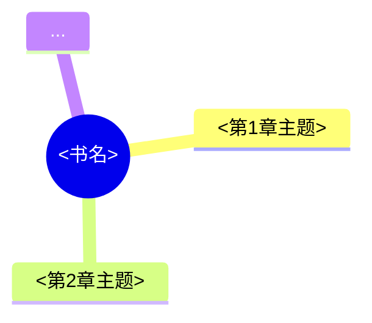
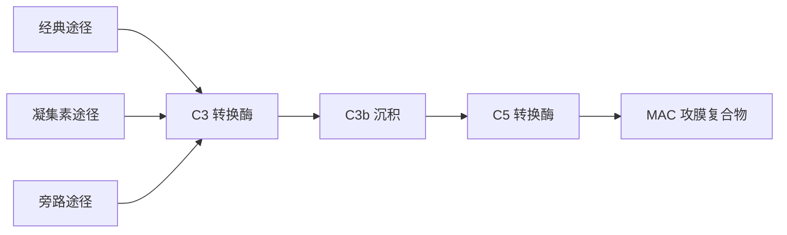

# 电子书阅读（E-Book Reader）— Chapter-by-Chapter PDF Reading & Book Q&A

## Overview

Read a PDF book/document chapter by chapter: extract the text, segment it into
chapters (embedded TOC first, heading heuristics as fallback), produce a
chapter-wise key-point summary as a Markdown file — including a **mind map per
chapter** and **verbatim preservation of math formulas, code examples, and
derivation steps** — and then stay available to answer the user's questions
about the book, with answers grounded in the book's actual text and cited to
chapter + page.

**OUTPUT FORMAT (MANDATORY):** In Summary mode, the deliverable MUST be written
as a **`.md` (Markdown) file** on disk at
`<WORKSPACE>/<bookname>_章节总结.md` (see step 6 for the full template). Never
deliver the summary only as chat text, and never output it as any other format
(docx, pdf, html, txt, etc.) unless the user explicitly asks for a different
format. After writing the file, present it to the user via the file-presentation
mechanism so it is visible and downloadable. A short chat recap is fine ON TOP
of the file, but the file itself is the deliverable and is never optional.

Two modes are supported:
1. **Summary mode** — turn the book into a structured chapter-by-chapter Markdown
   summary with per-chapter mind maps and verbatim formulas/code/derivations.
2. **Q&A mode** — answer questions about the book, always citing where in the book
   the answer comes from.

Both modes share the same extraction step (Step 1–2). Run extraction once; the
resulting JSON is reused by both modes and across follow-up questions.

**AI vision is a fallback, never the default.** Prefer the extracted text layer
for everything it can answer — including figure content that captions and prose
already describe. Only when figure text is garbled or missing (a frequent issue
with PDFs that embed fonts without proper ToUnicode mappings) — or the user asks
specifically about a figure's visual layout — follow **Step 2.5**: render THAT
page to PNG with `scripts/export_images.py` and use your image-reading capability
(the Read tool) to interpret the figure visually. Cite what you see rather than
guessing from mojibake. Do not render pages just because the PDF has images.

When the entire PDF has no text layer (scanned paper book / image-only PDF), the
extractor sets `is_scanned=true` — follow **Step 2.6** to read the book
page-by-page with AI vision. No external OCR is required. This is the only case
where bulk vision reading is appropriate.

## Portable paths (read before running commands)

All commands below use `~` (the current user's home directory) so the skill works
on any device. Resolve them as follows:

- **Skill directory**: `~/.workbuddy/skills/ebook-reader/` on a user-level
  install. If this skill is installed at project scope, use
  `<project>/.workbuddy/skills/ebook-reader/` instead. Locate the actual
  directory with: `ls ~/.workbuddy/skills/`
- **Python interpreter**: `~/.workbuddy/binaries/python/versions/<version>/python.exe`
  on Windows (pick the newest 3.x version present), or `python3` on macOS/Linux
  (or the managed interpreter under `~/.workbuddy/binaries/python/`). If the
  interpreter has neither `pypdf` nor `PyPDF2`, install it first (see Step 1).
- If a command fails because the exact version number differs on the target device,
  resolve the interpreter path with: `ls ~/.workbuddy/binaries/python/versions/`

## Workflow

### Step 1 — Extract text and chapter boundaries

Run the extractor and save its JSON to the workspace:

```bash
~/.workbuddy/binaries/python/versions/3.13.12/python.exe \
  ~/.workbuddy/skills/ebook-reader/scripts/extract_pdf.py \
  "<PATH_TO_PDF>" --out "<WORKSPACE>/_pdf_extract.json"
```

Replace `<PATH_TO_PDF>` with the user-provided absolute path and `<WORKSPACE>` with
the current working directory. If the script exits with code 2 ("neither pypdf nor
PyPDF2 is installed"), install the dependency into the managed Python environment
first (never globally):

```bash
~/.workbuddy/binaries/python/versions/3.13.12/python.exe -m pip install pypdf
```

The JSON contains `num_pages`, `has_embedded_toc`, `toc_usable`, `is_scanned`,
`chapters` (each with `index`, `title`, `start_page`, `end_page`, `text`), and
`pages` (full per-page text). Keep this file for the rest of the session — both
summary and Q&A read from it.

### Step 2 — Verify the chapter segmentation

Read `_pdf_extract.json` and check these fields **before** summarizing:

- **`is_scanned`** — if `true`, the PDF has no text layer (image-only scan, common
  for paper books scanned to PDF). Two paths are available now:
  1. **Ask the user to OCR first** — they can run OCR locally, then re-extract.
  2. **Use the built-in AI-vision path (Step 2.6)** — render pages to PNG and
     read them with the Read tool. No external OCR needed. This is now the
     preferred default unless the user specifically wants OCR.
- **`toc_usable`** — when `false`, the embedded outline exists but is only page
  numbers; the script already fell back to heading heuristics. Trust the `chapters`
  array but verify titles are meaningful.
- If `has_embedded_toc` is true and `toc_usable` is true, the split follows the
  book's own bookmarks — usually reliable.
- If heuristic: skim the detected `title` / `start_page` of each chapter. If
  boundaries are wrong (chapter merged with the next, heading missed), re-draw
  boundaries manually by reading the relevant `pages` text before continuing. Do not
  silently accept a bad split.

If the book has no usable structure at all, fall back to summarizing by fixed page
ranges (e.g. every 10–15 pages) labeled "第 1 部分 (p.1–15)" etc.

### Step 2.5 — Rescue garbled figures with AI vision

**Vision reading is a LAST RESORT, not the default path.** The extracted text
layer is the primary source of truth. Do NOT render-and-read pages just because
the PDF contains figures — most figure information is already conveyed (or
sufficiently approximated) by the text layer: captions, in-text descriptions,
surrounding prose, and the summary you write from them. Only invoke AI vision
when the text layer genuinely CANNOT provide the needed figure content (garbled
labels, missing diagram text, or a user question specifically about a figure's
visual layout). When you do use it, read only the specific figure's page — never
the whole book or whole chapter as images. Prefer targeted reads over bulk reads.

PDF text extraction often produces mojibake for figure labels, captions, and
diagram text — lines full of `$...$` tags or unmappable glyphs — while the body
prose extracts fine. When this happens, do **not** guess figure content from
garbage. Render the page image and read it with your vision capability
(the Read tool can display PNG/JPG/PDF images directly).

Trigger conditions — use AI vision reading ONLY when **any** of these is true
(text-layer-first, vision as fallback):

- `detect_math_code.py` returned `math` entries that are mostly mojibake
  (unmappable glyphs, `$...$` tags) — those are usually figure labels, not math,
  AND the caption/prose alone cannot convey the figure's content.
- The summary or the user's question depends on a specific figure's visual
  layout (pathway diagram, mechanism scheme, table, photo, graph) AND the text
  layer does not already describe it.
- A figure caption names content the text layer cannot convey (e.g. "图2.15
  三条补体激活途径" but the surrounding extracted text is unreadable).
- A page has very little or all-garbled body text but a clearly-present figure.

Do NOT trigger vision reading for: figures whose content is already fully
described in captions or prose, decorative images, or pages whose text extracts
fine. If the text layer answers the question, answer from text — no rendering
needed.

Workflow:

1. **Find candidate figure pages.** Optionally scan the extraction JSON for pages
   that contain Chinese figure captions (`图2.15` etc.) or unusually high
   garbled-character ratio:

   ```bash
   ~/.workbuddy/binaries/python/versions/3.13.12/python.exe \
     ~/.workbuddy/skills/ebook-reader/scripts/search_pdf.py \
     "<WORKSPACE>/_pdf_extract.json" "图" --top 50
   ```

   Each hit gives you the 0-based page index. Or just look at the book's own
   figure-number patterns (`图1.1`, `图2.15`, …) — the user often asks about a
   specific one.

2. **Render the page to PNG** (page numbers are 0-based, matching `_pdf_extract.json`):

   ```bash
   ~/.workbuddy/binaries/python/versions/3.13.12/python.exe \
     ~/.workbuddy/skills/ebook-reader/scripts/export_images.py \
     "<PATH_TO_PDF>" --pages 59,60,67 --out "<WORKSPACE>/_pdf_images" --dpi 150
   ```

   Requires PyMuPDF (`pymupdf` package). Install it into the managed env (never
   globally) before first use:

   ```bash
   ~/.workbuddy/binaries/python/versions/3.13.12/python.exe -m pip install pymupdf
   ```

   If PyMuPDF cannot be installed, fall back to `--embedded` mode which extracts
   raw embedded raster images via pypdf (rendering quality is usually better,
   but it's a useful fallback):

   ```bash
   ~/.workbuddy/binaries/python/versions/3.13.12/python.exe \
     ~/.workbuddy/skills/ebook-reader/scripts/export_images.py \
     "<PATH_TO_PDF>" --embedded --page 59 --out "<WORKSPACE>/_pdf_images"
   ```

3. **Read the PNG with the Read tool** (you are multimodal). Describe or
   transcribe the figure faithfully — labels, arrows, sequence, legend, axis
   values, anything important. Then incorporate that content into the summary
   (or the Q&A answer) with a clear reference like `（据图2.15，PDF p.59）` and
   a short citation of what the figure actually shows.

4. **If a figure is genuinely illegible** (scanned at too low DPI, blurry, in a
   foreign font, partially obscured): say so honestly — do not fabricate. Offer
   to re-export at higher `--dpi` (e.g. 250) or with `--pages` centered on the
   figure's exact page.

This vision step is shared by Mode A (summaries) and Mode B (Q&A). Use it
whenever the text layer alone cannot answer the question.

### Step 2.6 — Reading scanned / image-only PDFs with AI vision

A scanned PDF (or any PDF with no text layer) makes `extract_pdf.py` set
`is_scanned=true` and return a single placeholder chapter:
`（扫描版 PDF：未检测到文字层，需 OCR 才能总结）`. Despite that, the skill **can**
process such PDFs page-by-page using AI vision — no external OCR required.

Workflow when `is_scanned=true`:

1. **Confirm scope with the user** before reading every page. AI vision reads are
   slower and more expensive than text extraction (one PNG read per page). Two
   reasonable defaults:
   - **Small book (< ~30 pages)**: render and read all pages in one batch.
   - **Large book**: ask which chapters or page ranges matter most; read only
     those, then offer to extend.

2. **Render the relevant pages to PNG** (page numbers are 0-based, matching the
   page count in `_pdf_extract.json`):

   ```bash
   ~/.workbuddy/binaries/python/versions/3.13.12/python.exe \
     ~/.workbuddy/skills/ebook-reader/scripts/export_images.py \
     "<PATH_TO_PDF>" --pages 0,1,2,10-20 --out "<WORKSPACE>/_scanned_pages" --dpi 200
   ```

   Use `--dpi 200` or higher for dense text, diagrams, or non-Latin scripts. Use
   `--pages "0-N"` for an entire book in one call.

3. **Read each PNG with the Read tool** (your multimodal vision). As you read,
   build a per-page record: page number, what is on the page (title, headings,
   body, figures), and verbatim quotes worth citing. Process in batches of 5–10
   pages if the book is long.

4. **Synthesize** the per-page records into either a **chapter summary**
   (follow the Mode A template, using the read content as the source instead of
   extracted text) or a **direct answer** for Q&A mode.

5. **Always cite the page number** and that the source is a visual reading,
   e.g. `（p.10，AI 视觉识读）` — the user can then verify visually if needed.

6. **Save the rendered PNGs** under `<workspace>/_scanned_pages/` so the user can
   also browse them directly. They can be deleted later once the summary is
   accepted.

This mode treats the agent as an OCR-free reader. It complements but does not
replace real OCR — for high-volume archival work, dedicated OCR (Tesseract,
PaddleOCR, commercial services) is faster and more accurate. Use this path when
the user wants a quick read of a scanned PDF without setting up an OCR toolchain.

### Mode A — Summary mode: write the chapter summary

1. **Locate math / code / derivations first.** Run the detector on the extracted
   JSON so nothing important is missed:

```bash
~/.workbuddy/binaries/python/versions/3.13.12/python.exe \
  ~/.workbuddy/skills/ebook-reader/scripts/detect_math_code.py \
  "<WORKSPACE>/_pdf_extract.json" --context 400
```

   For every chapter, read the detected `math`, `code`, and `derivation` entries
   (page numbers are zero-based; add 1 when presenting). Skim each chapter's `text`
   too — the detector is a helper, not a guarantee. **Rules that MUST be followed:**

   - **Math formulas / equations**: reproduce verbatim in the summary (LaTeX-style
     or Unicode text as extracted; keep `$...$`/`$$...$$` markers if present). Never
     summarize a formula in words alone.
   - **Code examples**: include the actual code block verbatim in a fenced code
     block (```python / ```cpp / etc. matching the language if identifiable).
   - **Derivation / worked proofs**: reproduce the derivation step by step — every
     intermediate line from the source must be preserved; do not collapse a multi-step
     derivation into "推导过程略".
   - **Definitions / data tables**: verbatim or near-verbatim as well.
   - If a formula/code/derivation is too garbled by extraction to reproduce, keep the
     closest readable version and add "(原文提取可能不完整)" rather than dropping it.

2. For each chapter block, read its `text` and produce a **key-point summary**, dense
   and useful rather than a paraphrase. Per chapter:
   - 1–2 sentence "核心立意" (what the chapter is really about).
   - A bullet list of 3–8 **关键要点** (concepts, arguments, methods, facts, decisions).
   - **公式与代码** section with verbatim formulas, code, and derivations (Step 1).
   - Flag **开放问题或争议** if raised.
   - **Record abbreviations** (缩写词) used in the chapter's content together with
     their full names as given in the book (e.g. `DNA（脱氧核糖核酸）`,
     `TNF-α（肿瘤坏死因子-α）`). Take the full name ONLY from the book itself —
     the first place the abbreviation is expanded in the text (or from a glossary
     if the book has one). If the book never gives the full name, keep the
     abbreviation and mark it `（原文未给出全称）`; never invent a full name.
     Keep one consolidated list across all chapters (dedupe; same abbreviation,
     same full name).
   - **Draw a relationship diagram (关系图) for clearly-ordered content**: when the
     chapter describes anything with an explicit sequence / before-after order /
     cause-effect chain — e.g. a biological pathway, a step-by-step process,
     an algorithm pipeline, a historical timeline, a signaling cascade, a lifecycle,
     a dependency chain, a chronological narrative — draw a **simple Mermaid diagram**
     for it in the summary. Use the most fitting Mermaid type:
     - `flowchart LR` / `flowchart TD` — process steps, pathways, dependency chains
       (the default for most "A→B→C" content).
     - `sequenceDiagram` — interactions ordered over time between participants
       (e.g. signal transduction, request/response flows).
     - `timeline` — historical / chronological events.
     - `stateDiagram-v2` — state transitions (e.g. lifecycles, state machines).
     Keep each diagram SMALL and readable: ≤ ~10 nodes, short labels (2–6 chars
     where possible), arrows labeled only when the label is essential. Only draw
     what the book actually states — never invent steps. See step 5 for placement
     and examples.
3. If a chapter's `text` is very long (> ~12k characters), split it into sub-sections
   and summarize each before combining.

4. **Build the mind map per chapter.** Draw a Mermaid `mindmap` block summarizing the
   chapter's structure (root = chapter title; branches = main topics; leaves = key
   points). Keep each mind map ≤ ~2 levels deep and ≤ ~20 nodes so it stays legible.
   Place it right after the chapter heading. Example:

   ````markdown
   ## 第 2 章 机器学习基础（p.3–3）
   **核心立意：** ...
   **关键要点：**
   - ...

   ```mermaid
   mindmap
     root((机器学习基础))
       三大范式
         监督学习
         无监督学习
         强化学习
       核心方法
         损失函数
         优化
   ```
   ````

   Render-friendly notes: wrap the Mermaid block in a fenced code block with language
   `mermaid`; escape parentheses inside node labels by using quotes
   (`root(("标题(含括号)"))`) when needed.

5. **Draw relationship diagrams for ordered content.** For every clearly-ordered
   piece of content identified in step 2 (sequence / process / pathway / timeline /
   causal chain), produce a small Mermaid diagram and place it **in the chapter
   where that content belongs** (usually right after the relevant 关键要点 bullet or
   inside the 公式/代码/推导 section, or under a dedicated "**关系图：**" line).
   Examples:

   - Flowchart (pathway / process):
     ````markdown
     **关系图（补体激活级联，书中 p.52–53）：**
     ```mermaid
     flowchart LR
       A[经典途径] --> C[C3 转换酶]
       B[凝集素途径] --> C
       D[旁路途径] --> C
       C --> E[C3b 沉积]
       E --> F[C5 转换酶]
       F --> G[MAC 攻膜复合物]
     ```
     ````
   - Sequence diagram (ordered interaction over time):
     ````markdown
     **关系图（T 细胞激活时序，书中 p.XX）：**
     ```mermaid
     sequenceDiagram
       participant APC as APC
       participant TCR as TCR
       participant CD as 共刺激分子
       APC->>TCR: 抗原肽-MHC 呈递
       TCR->>TCR: 信号 1
       APC->>CD: B7 结合 CD28
       CD->>CD: 信号 2
     ```
     ````
   - Timeline (chronological events):
     ````markdown
     **关系图（历史时间线，书中 p.XX）：**
     ```mermaid
     timeline
       title 事件时间线
       1900 : 发现 X
       1930 : 提出 Y
       1960 : 证实 Z
     ```
     ````

   Rules: one diagram per clearly-ordered topic (do not force diagrams where the
   book has none); ≤ ~10 nodes; short labels; arrows labeled only when essential;
   draw ONLY what the book states — no invented steps; if a step is only implied,
   keep it and mark the uncertain transition with a dashed arrow (`-.->`) and a
   note `（书中未明说，推断）` or omit it. If a diagram is too complex to stay
   small, split it into two diagrams or describe the rest in prose with a note.

6. Write the final summary as a `.md` file. The deliverable MUST be a Markdown
   file saved to `<WORKSPACE>/<bookname>_章节总结.md` — never a chat-only reply,
   never another format (unless the user explicitly requests one). Use the Write
   tool to create the file with this exact structure:

**Position rule (MUST follow):** the 缩写词表 MUST be the first section of the
file — immediately after the `# 标题` and the `> 来源` line, before 全书概览.
It is NOT a footer/appendix; never place it at the end of the file. If the book
has a natural glossary/术语表 that you also quote, you may additionally reproduce
it at the end, but the abbreviation table itself always stays at the top.

```markdown
# 《<书名>》章节关键总结

> 来源：<文件名>  · 共 <N> 页  · 自动切分 <M> 章  · 生成日期 <YYYY-MM-DD>

## 缩写词表（Abbreviations）
> 本总结涉及的所有缩写词及其全称（以书中原文为准；原文未给出全称的标注"原文未给出"）。
> 出处页码为 PDF 页（0-based + 1）。

| 缩写 | 全称（原文） | 出处 |
|------|--------------|------|
| DNA  | Deoxyribonucleic acid（脱氧核糖核酸） | 第 1 章 p.5 |
| RNA  | Ribonucleic acid（核糖核酸） | 第 1 章 p.5 |
| ...  | ... | ... |

## 全书概览
<3–6 句话概括本书主旨、目标读者、核心价值与整体脉络>

## 全书思维导图

```

## 目录
1. [<第1章标题>](#<锚点1>) — p.<start>–<end>
2. [<第2章标题>](#<锚点2>) — p.<start>–<end>
...

## 第 1 章 <标题>（p.<start>–<end>）


```

**核心立意：** <一句话>

**关键要点：**
- ...
- ...

**关系图（有明确先后顺序/流程/时序/因果的内容，无则省略本节）：**
> 例：补体激活级联（书中 p.52–53）


**公式 / 代码 / 推导：**
> 数学公式（书中原文，p. X）：
> `$$ ... $$` 或纯文本公式

> 代码示例（书中原文，p. X）：
> ```python
> ...原样代码...
> ```

> 推导过程（书中原文，p. X–Y）：
> 第 1 步 ... 
> 第 2 步 ...
> ...

**开放问题或争议：** <如有>

## 第 2 章 <标题>（p.<start>–<end>）
...
```

Use GitHub-style heading anchors (`#` + lowercased title, spaces as hyphens) so the
目录 links resolve. Present the `.md` file to the user (the file is the deliverable —
do not substitute a chat-only summary).

7. **Verify the written file before delivering (MANDATORY).** After writing the
   `.md` file, re-check it against the source BEFORE presenting it to the user.
   Do not rely on memory or on what "the experiment must have looked like" —
   re-read the actual source (the relevant `pages`/`chapters` text in
   `_pdf_extract.json`, or re-open the rendered PNG in Step 2.5/2.6 mode). Run
   through this checklist for every factual claim in the file:

   - **Hard data**: doses, timings (Day -X / Day X), group labels (e.g. G1/G2,
     Q1/Q2), cell numbers, percentages, p-values, survival days — each must
     match the source EXACTLY, character for character. Never "fix up" or
     "rationalize" a group design to make it look like a sensible experiment;
     if the source shows something unusual, transcribe it as-is.
   - **Figure interpretation**: for every sub-panel described (Figure N panel
     A/B/C/...), confirm the description (axis labels, legend, trend, key
     numbers) against the actual figure, not against what the panel is likely
     to show.
   - **Verbatim content**: formulas, code, derivations, definitions, and quotes
     must be byte-identical to the source; if any is garbled, keep the closest
     readable version with the "(原文提取可能不完整)" note rather than silently
     "correcting" it.
   - **Abbreviation table**: every 缩写/全称 pair traces to the book; nothing
     invented, nothing guessed.
   - **Relationship diagrams**: every step/arrow reflects what the source
     actually states; inferred transitions are marked `（书中未明说，推断）`.
   - **Citations**: chapter title and page number point at the passage that
     actually supports the claim.

   If any item fails, fix the file immediately and re-check; only then present
   it. Common failure pattern to guard against: when the user (or a second
   read) asks "are you sure?", the correct response is to re-open the source —
   not to defend the draft.

### Mode B — Q&A mode: answer questions using the book's content

When the user asks a question about the book (after or instead of a summary), do
NOT answer from memory. Ground every answer in the extracted text.

**First, load the grounding rules before answering any question:**
`Read references/qa_grounding.md`
(follow its core principle, citation format, and anti-fabrication checklist for
every single answer — answers must be traceable to the extracted text, never
fabricated from outside knowledge).

1. **Locate the relevant passages** with the search script:

```bash
~/.workbuddy/binaries/python/versions/3.13.12/python.exe \
  ~/.workbuddy/skills/ebook-reader/scripts/search_pdf.py \
  "<WORKSPACE>/_pdf_extract.json" "<关键词1>" "<关键词2>" --top 8
```

Choose query terms that capture the user's question (Chinese and/or English, synonyms
as separate terms). The script returns snippets with `chapter_title`, `page`
(zero-based), `match_count`, and `snippet`.

2. **Read the source context**: open the relevant `chapters[i].text` (or the specific
   `pages` entries) from the JSON to see the full passage around each hit — the
   snippet alone is often too short. Use the Read tool or Grep on
   `<WORKSPACE>/_pdf_extract.json` for the exact passage.

3. **Answer strictly from the book**: summarize/quote what the book says, then cite
   the source with chapter title and page number, e.g.:

   > 书中第 3 章「...」（p. 45–46）提到：...

   When the question is about a formula, code, or derivation, reproduce the exact
   formula/code/steps from the book — the same verbatim rule as the summary mode.

4. **If the book does not cover the question**: say so explicitly — "书中没有直接
   讨论这个问题" — and, if useful, briefly mention the nearest related passage you
   did find. Never fabricate an answer or dress up outside knowledge as the book's
   content. If the user asks an opinion/analysis question, you may add your own view
   AFTER clearly separating it from what the book says (label it "我的看法").

5. **Handle follow-ups efficiently**: reuse the same `_pdf_extract.json`; do not
   re-extract the PDF for each question. Multiple questions in a row can share one
   search run when terms overlap.

6. **Verify before answering (MANDATORY).** Before sending any Q&A answer, run
   the same source-check as Mode A step 7 for the hard facts in your answer:
   doses, timings, group labels, numbers, page citations — re-open the passage
   and confirm, don't reconstruct from memory. If the user later asks "are you
   sure?", re-read the source instead of defending the draft.

## Edge cases

- **Scanned / image-only PDF:** `is_scanned` is true. Do **not** stop with an empty
  summary. Use **Step 2.6**: render the relevant pages to PNG with
  `scripts/export_images.py` and read them with the Read tool (your multimodal
  vision). Cite what you saw, e.g. `（p.10，AI 视觉识读）`. Cost grows linearly
  with page count — confirm scope with the user before reading a whole book.
- **Numeric-only bookmarks:** `toc_usable: false`; heading heuristics are used, so you
  won't get hundreds of one-page "chapters".
- **Multi-column / noisy extraction:** text order may be garbled. Skim output quality;
  if unusable, warn the user rather than summarizing confidently wrong content. For
  formulas extracted out of order, reconstruct the intended order from surrounding
  text where unambiguous, and note the extraction was noisy.
- **Front/back matter:** preface, appendix, index may split as their own blocks. Merge
  or drop them as appropriate; keep them out of key summaries unless the user asks.
- **User asks about a page/quote:** run search_pdf.py with a distinctive phrase from
  the quote to locate it, then read the full surrounding text before answering.
- **Very large books:** if the JSON file is huge, avoid reading it all into context;
  rely on search_pdf.py / detect_math_code.py hits + targeted Read/Grep on the JSON.
- **Abbreviations without an explicit full name:** if the book uses an abbreviation
  but never expands it (or the expansion is garbled by extraction), list it in the
  缩写词表 with the full name as extracted, and add "（原文未给出全称）" when the
  book truly never states it. Never guess the expansion. If the book has a glossary /
  术语表, prefer it as the source for full names.
- **No explicit order in the book:** only draw a relationship diagram when the book
  itself presents a clear before-after / process / causal order. If the text merely
  lists parallel facts (no sequence), skip the diagram — do not invent an order.
- **Complex processes:** if a process has > ~10 steps, split it into 2–3 chained
  sub-diagrams rather than one crowded graph, or cover part in prose with a note.
- **User asks "are you sure?" about a claim:** never defend the draft from
  memory. Re-open the actual source (the extracted `pages` text or the rendered
  PNG for scanned PDFs), verify the exact dose/timing/group label/number, and
  correct the file if needed. Treat every "are you sure?" as a trigger to
  re-verify, not to argue. When the user points out a specific figure (e.g.
  "Figure 3H says ..."), zoom into that panel and transcribe it exactly.
- **Scanned-PDF ordered content:** in Step 2.6 visual reading, still draw the
  diagram for ordered content, citing the page where the sequence was read from
  (e.g. `（p.52，AI 视觉识读）`).
- **Formula-heavy books (math/physics/CS):** if the whole book is dense with formulas,
  prefer keeping "公式与代码" sections inside each chapter and also note the most
  important ones in the 全书概览.
- **Garbled figures / unreadable diagrams:** when figure captions or diagram text
  comes back as mojibake (`$...$` tags, unmapped glyphs) or is missing entirely,
  AND the surrounding text cannot convey the figure's content, follow **Step 2.5**:
  render THAT page to PNG with `scripts/export_images.py` and use your vision
  capability (the Read tool) to interpret the figure. Cite what you actually saw,
  e.g. `（图2.15，PDF p.59，据视觉解读）`. Do not guess. If the text layer already
  describes the figure adequately, do not render it — vision is a fallback, not
  a default.
- **Mind map rendering:** Mermaid mindmap syntax is supported by Typora, VS Code
  (Mermaid extension), GitHub, and other Mermaid renderers. If the user's viewer does
  not render Mermaid, the markdown still shows the structure as plain code — offer to
  convert mind maps to indented bullet trees on request.

## Resources

- `scripts/extract_pdf.py` — deterministic extraction: per-page text, embedded TOC,
  best-effort chapter segmentation, scanned-PDF detection. Always run this first.
- `scripts/search_pdf.py` — keyword search over the extracted JSON; returns snippets
  with chapter + page info. Use for every Q&A answer to locate relevant passages.
- `scripts/detect_math_code.py` — scans each chapter for math formulas, code examples,
  and derivation passages so they can be reproduced verbatim in the summary. Run it
  in summary mode before writing the deliverable.
- `scripts/export_images.py` — renders selected PDF pages to PNG (PyMuPDF) or
  extracts raw embedded images (pypdf fallback) so the AI's vision capability can
  read figures whose text layer is garbled. Use whenever detect_math_code returns
  mojibake or the user asks about a specific figure. Requires `pymupdf` for the
  rendering path (one-time `pip install pymupdf`).
- `references/qa_grounding.md` — how to keep answers faithful to the book: citation
  format, handling questions the book doesn't answer, separating book content from
  assistant opinion.
